# Lab 2: Numbers and Displays

Combinational circuits for binary-to-decimal conversion and BCD addition. Parts I to V.

Board: **DE10-Lite**, MAX 10 `10M50DAF484C7G`. Verilog modules live in `verilog/`
(top level `main`).

> **Board differences.** The lab manual targets the DE2, which has 18 switches, 8 displays
> and separate green LEDs. The DE10-Lite has 10 switches, 6 displays and red LEDs only.
> Every part is scaled to the switches available, and anything the manual routes to the
> green LEDs (LEDG) goes to `LEDR` instead. Pin usage per part is stated below.

---

## Part I: 7-Segment Decoder

Display the value of a 4-bit switch group on a 7-segment display. Digits 0 to 9 are
required; the valuations 1010 to 1111 are don't-cares.

`SW[3:0]` drives `HEX0` and `SW[7:4]` drives `HEX1`, two digits rather than the manual's
four.

### Schematic and truth table

The segment outputs are **active low**, so a `0` lights the segment. Each output was
minimized separately from its K-map and written as a single `assign` statement, as the
manual requires.

<table>
<tr>
<td width="39%" valign="top" align="center">
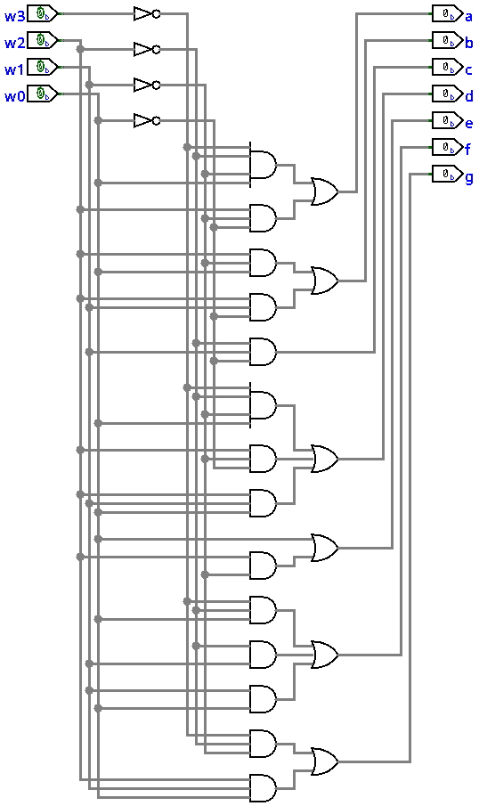<br>
<sub>Logisim <code>segment7</code>: inverted inputs on the left, one AND/OR cone per output</sub>
</td>
<td width="61%" valign="top" align="center">
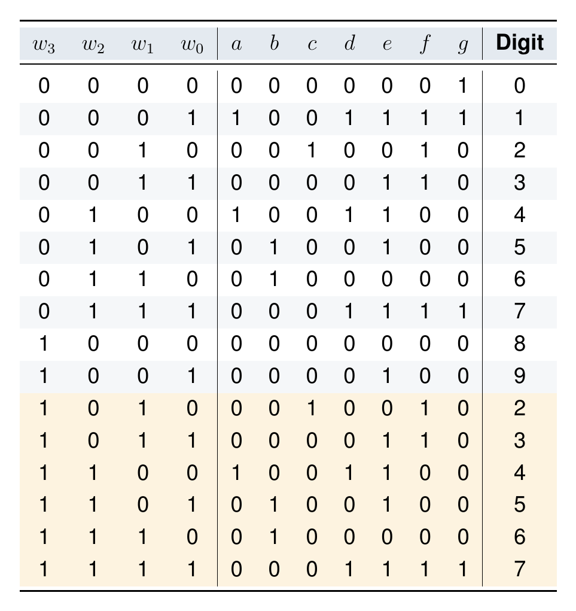<br>
<sub>Exported truth table. Shaded rows are the 1010 to 1111 don't-cares, whose patterns the minimizer reused from 2 to 7</sub>
</td>
</tr>
</table>

### `seg7.v`

```verilog
module seg7 (
    input w0, w1, w2, w3,
    output [7:0] hex
);

assign hex[0] = ~w3 & ~w2 & ~w1 & w0 | w2 & ~w1 & ~w0;                 // a
assign hex[1] = w2 & ~w1 & w0 | w2 & w1 & ~w0;                         // b
assign hex[2] = ~w2 & w1 & ~w0;                                        // c
assign hex[3] = ~w3 & ~w2 & ~w1 & w0 | w2 & ~w1 & ~w0 | w2 & w1 & w0;  // d
assign hex[4] = w0 | w2 & ~w1;                                         // e
assign hex[5] = ~w3 & ~w2 & w0 | ~w2 & w1 | w1 & w0;                   // f
assign hex[6] = ~w3 & ~w2 & ~w1 | w2 & w1 & w0;                        // g
assign hex[7] = 1;                                                     // decimal point off

endmodule
```

### On the board

`SW[7:4]` = 4 and `SW[3:0]` = 2, so `HEX1` shows `4` and `HEX0` shows `2`. `HEX5` through
`HEX2` are tied to `8'h0`, which lights every segment and the decimal point, giving the
`8.` at the left. The K-map work for the segment equations is on the notebook page
underneath.

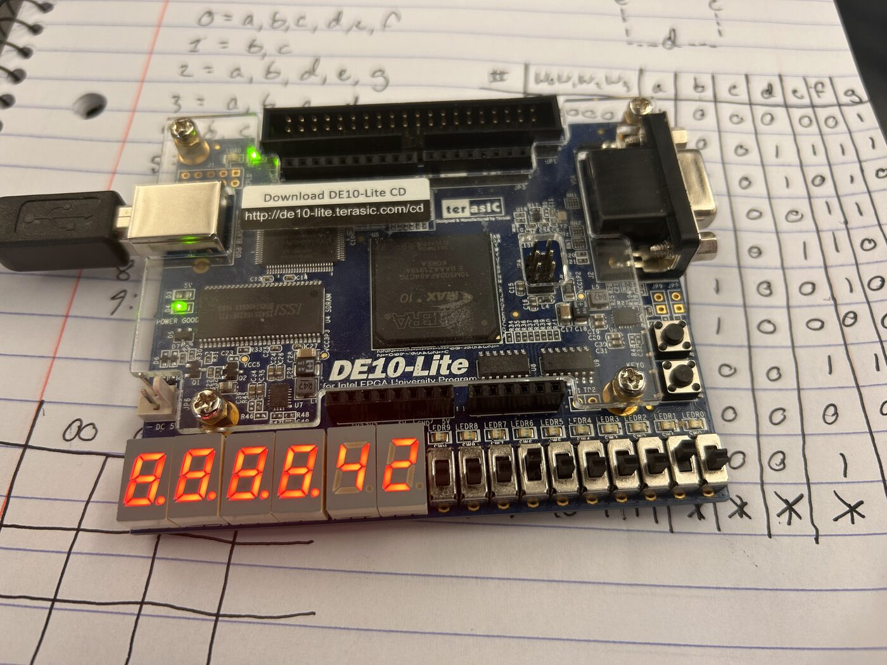

### `main.v` for Part I

```verilog
seg7 u_hex0 (
    .w0  (SW[0]),
    .w1  (SW[1]),
    .w2  (SW[2]),
    .w3  (SW[3]),
    .hex (HEX0)
);

seg7 u_hex1 (
    .w0  (SW[4]),
    .w1  (SW[5]),
    .w2  (SW[6]),
    .w3  (SW[7]),
    .hex (HEX1)
);
```

### RTL view

Two `seg7` instances, one per display. Unused displays and `LEDR` are tied off
([PDF](images/part1_rtl.pdf)).

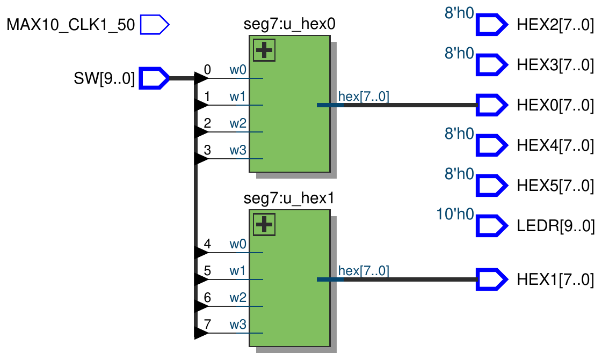

Expanded to gate level ([PDF](images/part1_rtl_ex.pdf)). The decoder synthesizes to a flat
two-level AND/OR network, which is what a sum-of-products description gives:

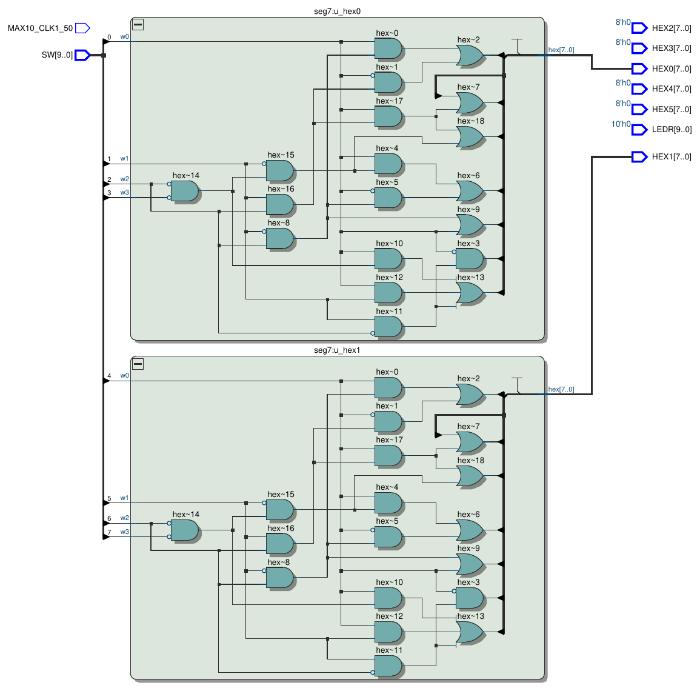

---

## Part II: Binary to Decimal Conversion

Convert a 4-bit binary number `V = v3v2v1v0` into two decimal digits `D = d1 d0`.

| Binary value | d1 | d0 |
| --- | --- | --- |
| 0000 | 0 | 0 |
| 0001 | 0 | 1 |
| ... | ... | ... |
| 1001 | 0 | 9 |
| 1010 | 1 | 0 |
| 1011 | 1 | 1 |
| 1100 | 1 | 2 |
| 1101 | 1 | 3 |
| 1110 | 1 | 4 |
| 1111 | 1 | 5 |

`V` is on `SW[3:0]`; `d1` shows on `HEX1` and `d0` on `HEX0`.

### How it works

The comparator raises `z` when `V > 9`. That one bit drives the rest of the circuit:

- `z` selects, through four 2-to-1 muxes, between the raw value `V` (when `V <= 9`) and
  `V - 10` produced by circuit A (when `V > 9`).
- `z` also drives circuit B, which sets the tens digit: `0` when `z` is low, `1` when `z`
  is high.

**Comparator.** `V > 9` means `v3` is set *and* at least one of `v2`, `v1` is set
(1000 and 1001 are still <= 9):

```verilog
module myComparator(
    input v3, v2, v1, v0,
    output z
);

assign z = v3 & (v2 | v1);

endmodule
```

<table>
<tr>
<td width="52%" valign="top" align="center">
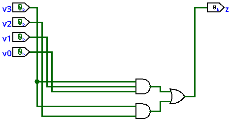<br>
<sub>Logisim <code>myComparator</code></sub>
</td>
<td width="48%" valign="top" align="center">
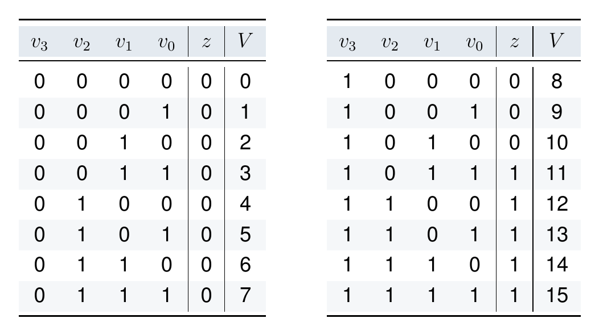<br>
<sub>Exported truth table</sub>
</td>
</tr>
</table>

*The Logisim draft wires a 3-input AND (`v3 & v1 & v0`) where the Verilog has `v3 & v1`, so
its table reads `z = 0` at V = 10. `myComparator.v` above is the corrected version and is
what was synthesized.*

**Circuit A.** For `V` in 10 to 15, `V - 10` is 0 to 5. Because `v3` is always 1 in that
range, only `v2 v1 v0` matter, and the subtraction reduces to three expressions:

```verilog
module CircuitA(
    input i2, i1, i0,
    output o2, o1, o0
);

assign { o2, o1, o0 } = { i2 & i1, ~i1, i0 };

endmodule
```

One AND gate and one inverter, with `o0` passed straight through:

<table>
<tr>
<td width="60%" valign="top" align="center">
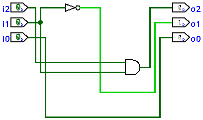<br>
<sub>Logisim <code>CircuitA</code></sub>
</td>
<td width="40%" valign="top" align="center">
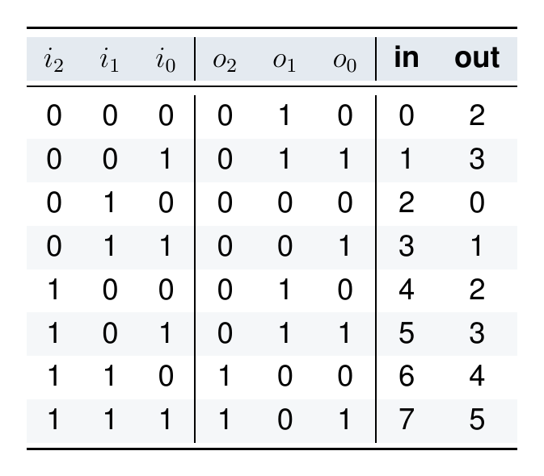<br>
<sub>Exported truth table, with decimal in/out</sub>
</td>
</tr>
</table>

**Circuit B.** Drives the seven segments of the tens digit from `z`, showing `0` or `1`
without a second decoder. Segments are active low, so `b` and `c` are held at 0 to form
the `1`:

```verilog
module CircuitB (
    input z,
    output s0, s1, s2, s3, s4, s5, s6
);

assign { s0, s1, s2, s3, s4, s5, s6 } = { z, 1'b0, 1'b0, z, z, z, 1'b1 };

endmodule
```

<table>
<tr>
<td width="25%" valign="top" align="center">
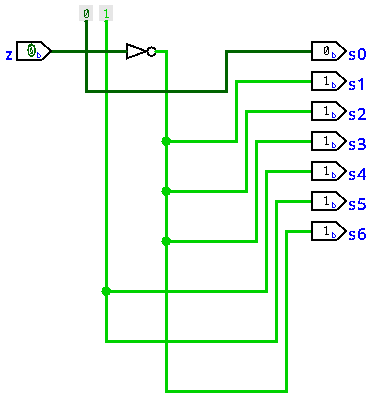<br>
<sub>Logisim <code>CircuitB</code></sub>
</td>
<td width="75%" valign="top" align="center">
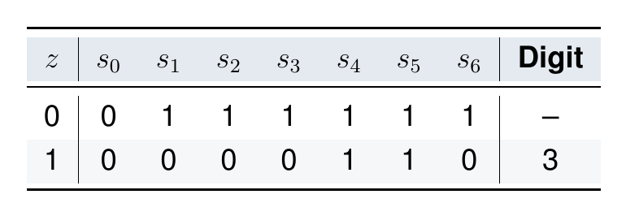<br>
<sub>Exported truth table</sub>
</td>
</tr>
</table>

*The Logisim draft ties `s4`/`s5` high and inverts `z` into the rest, so it cannot light
segments e and f. Its Digit column reads `-` and `3` instead of `0` and `1`.
`CircuitB.v` above is the corrected version and is what was synthesized.*

**Multiplexer.**

```verilog
module mux_2_1(
    input  s,
    input  x,
    input  y,
    output m
);

assign m = (~s & x) | (s & y);

endmodule
```

### `main.v` for Part II

`m3` is muxed against a hard `0`, since `V - 10` never exceeds 5 and its top bit is always
clear.

```verilog
wire v0, v1, v2, v3, z;
assign { v0, v1, v2, v3 } = { SW[0], SW[1], SW[2], SW[3] };

myComparator comp (
    .v3 (v3),
    .v2 (v2),
    .v1 (v1),
    .v0 (v0),
    .z  (z)
);

wire o2, o1, o0;
CircuitA cA (
    .i2 (v2),
    .i1 (v1),
    .i0 (v0),
    .o2 (o2),
    .o1 (o1),
    .o0 (o0)
);

wire m0, m1, m2, m3;
mux_2_1 mx0 (.s(z), .x(v0), .y(o0),   .m(m0));
mux_2_1 mx1 (.s(z), .x(v1), .y(o1),   .m(m1));
mux_2_1 mx2 (.s(z), .x(v2), .y(o2),   .m(m2));
mux_2_1 mx3 (.s(z), .x(v3), .y(1'b0), .m(m3));

seg7 u_hex0 (
    .w0  (m0),
    .w1  (m1),
    .w2  (m2),
    .w3  (m3),
    .hex (HEX0)
);

CircuitB cB (
    .z  (z),
    .s0 (HEX1[0]),
    .s1 (HEX1[1]),
    .s2 (HEX1[2]),
    .s3 (HEX1[3]),
    .s4 (HEX1[4]),
    .s5 (HEX1[5]),
    .s6 (HEX1[6])
);

assign HEX1[7] = 1'b1;
```

### On the board

Counting `V` up through the switches. `HEX0` runs 0 to 9 while `HEX1` stays at `0`, then
`HEX1` flips to `1` and `HEX0` restarts at 0, so 10 through 15 read as `10` to `15`.
`HEX1` never shows anything but `0` or `1`, which is what the comparator and circuit B are
there for.

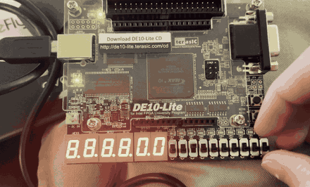

### Logisim top level

`main` in `Part1_7Seg_Decode.circ` wires the whole part together: comparator, circuit A,
the four muxes, the decoder and circuit B, with both digits on 7-segment displays.

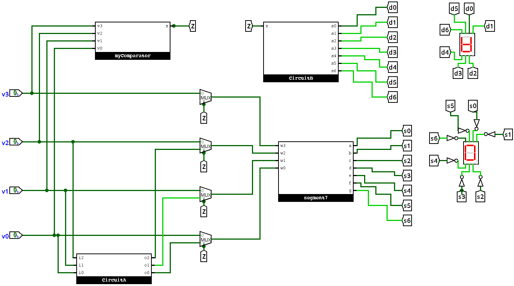

### RTL view

Comparator and circuit A feed the four muxes; the muxes feed the decoder for `d0`, and
circuit B drives `d1` on its own ([PDF](images/part2_rtl.pdf)).

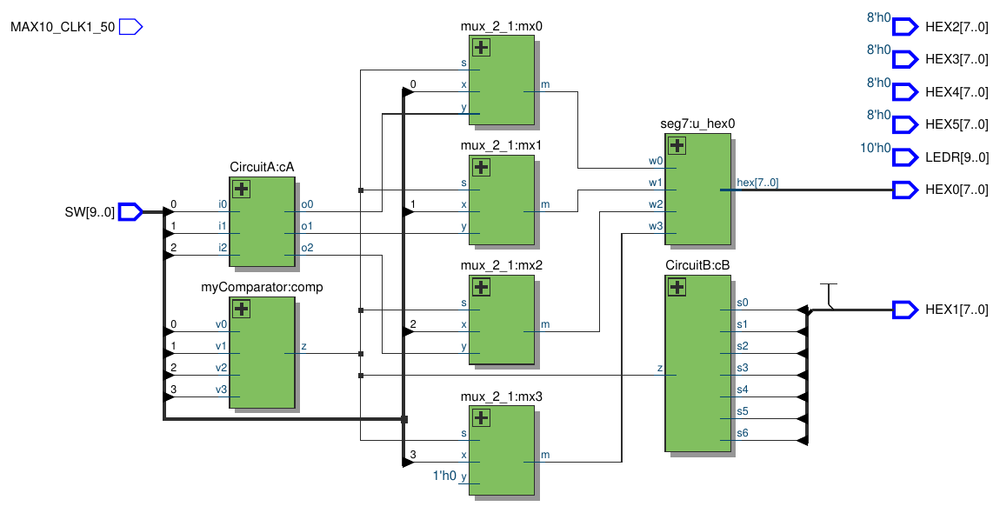

Expanded ([PDF](images/part2_rtl_ex.pdf)):

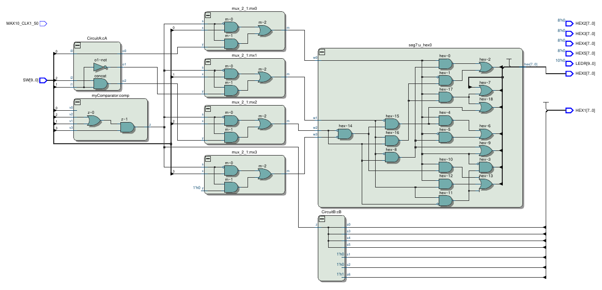

---

## Part III: Ripple-Carry Adder

Four full adders chained carry-out to carry-in, forming a 4-bit adder.

`A` is on `SW[7:4]`, `B` on `SW[3:0]`, and `c_in` on `SW[8]`. The sum `S` goes to `LEDR[3:0]`.

### Full adder

`c_o` is the majority function of the three inputs; `s` is their odd-parity function,
written here as the four minterms where an odd number of inputs are 1.

```verilog
module fa (
    input b, a, ci,
    output co, s
);

assign co = a & ci | b & ci | b & a;
assign s  = ~b & ~a & ci | ~b & a & ~ci | b & ~a & ~ci | b & a & ci;

endmodule
```

<table>
<tr>
<td width="51%" valign="top" align="center">
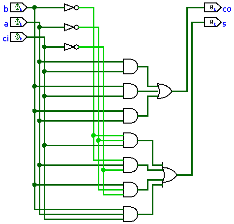<br>
<sub>Logisim <code>FA</code></sub>
</td>
<td width="49%" valign="top" align="center">
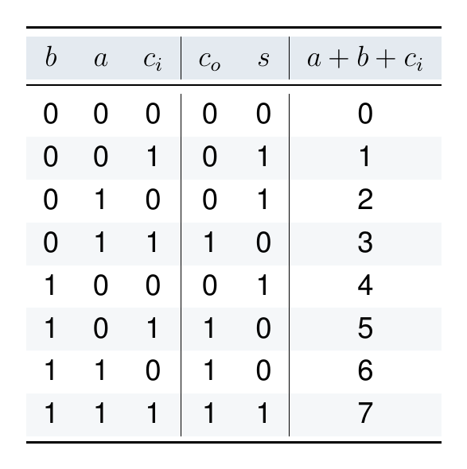<br>
<sub>Exported truth table</sub>
</td>
</tr>
</table>

Four instances chained into the ripple-carry adder:

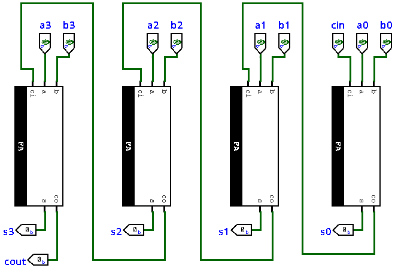

### `main.v` for Part III

```verilog
wire c1, c2, c3, cout;

fa fa0 (
    .b  (SW[0]),
    .a  (SW[4]),
    .ci (SW[8]),
    .co (c1),
    .s  (LEDR[0])
);

fa fa1 (
    .b  (SW[1]),
    .a  (SW[5]),
    .ci (c1),
    .co (c2),
    .s  (LEDR[1])
);

fa fa2 (
    .b  (SW[2]),
    .a  (SW[6]),
    .ci (c2),
    .co (c3),
    .s  (LEDR[2])
);

fa fa3 (
    .b  (SW[3]),
    .a  (SW[7]),
    .ci (c3),
    .co (cout),
    .s  (LEDR[3])
);
```

`cout` is left unconnected here. Part IV consumes it, feeding the full 5-bit result into
the binary-to-BCD converter.

### RTL view

The carry chain runs left to right through the four `fa` instances
([PDF](images/part3_rtl.pdf)):

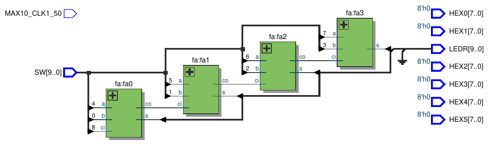

Expanded ([PDF](images/part3_rtl_ex.pdf)):

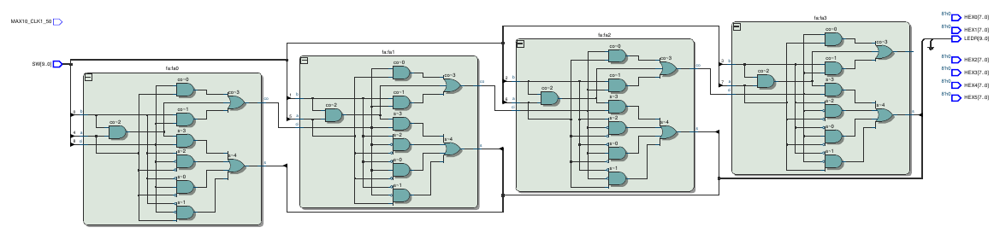

---

## Part IV: One-Digit BCD Adder

Add two BCD digits `A` and `B` plus a carry-in, giving a two-digit BCD sum `S1 S0`. The
largest value the circuit has to handle is 9 + 9 + 1 = 19.

`A` is on `SW[7:4]`, `B` on `SW[3:0]`, `c_in` on `SW[8]`. The sum shows on `HEX1`/`HEX0`.

### How it works

The Part III ripple-carry adder already produces a five-bit binary result
`{c_out, s[3:0]}`, covering 0 to 31. What is left is a converter from that binary value to
two BCD digits, the same job as Part II one bit wider.

`bin2bcd_4` does it with `assign` statements only. The upper four bits `s[4:1]` hold the
value divided by two, so the equations convert `2 * s[4:1]` to BCD and let `s[0]` fall
through as the ones-digit LSB. Doubling always gives an even BCD result, so that last bit
can never cause a carry.

```verilog
module bin2bcd_4 (
    input [4:0] s,
    output [7:0] t
);

    // s = { cout, sum[3:0] }, value 0..31
    // t = { tens digit (t[7:4]), ones digit (t[3:0]) }

    assign t[7] = 0;
    assign t[6] = 0;
    assign t[5] = s[4] & s[2] | s[4] & s[3];
    assign t[4] = s[4] & ~s[3] & ~s[2] | ~s[4] & s[3] & s[1] | ~s[4] & s[3] & s[2] | s[3] & s[2] & s[1];
    assign t[3] = s[4] & ~s[3] & ~s[2] & s[1] | ~s[4] & s[3] & ~s[2] & ~s[1] | s[4] & s[3] & s[2] & ~s[1];
    assign t[2] = s[4] & ~s[2] & ~s[1] | ~s[4] & ~s[3] & s[2] | s[4] & s[3] & ~s[2] | ~s[4] & s[2] & s[1];
    assign t[1] = s[4] & ~s[3] & ~s[2] & ~s[1] | ~s[4] & ~s[3] & s[1] | ~s[3] & s[2] & s[1] | s[4] & s[3] & ~s[2] & s[1] | ~s[4] & s[3] & s[2] & ~s[1];
    assign t[0] = s[0];

endmodule
```

Logisim `bcd_FA_4`, the Part III adder feeding the converter:

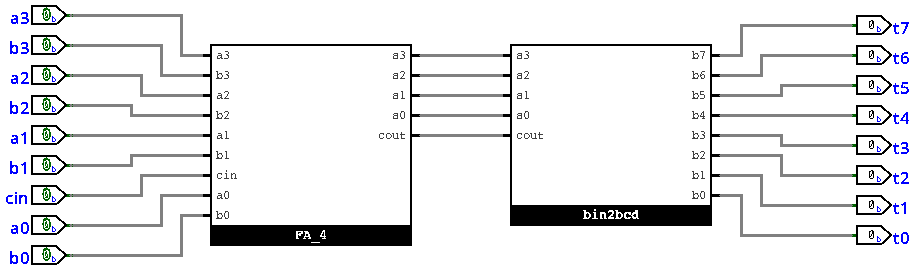

Inside `bin2bcd`, one AND/OR cone per output bit:

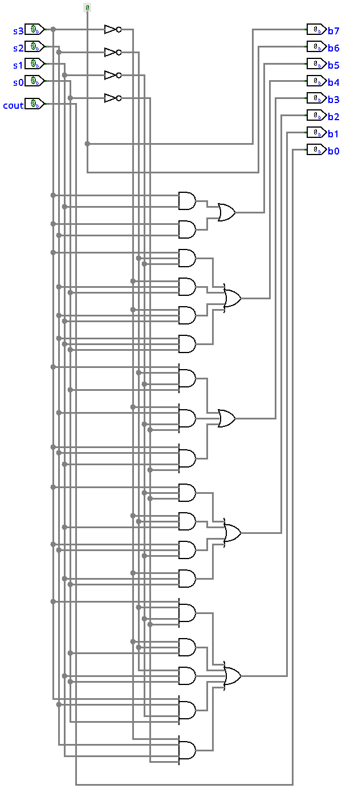

Its truth table, all 32 values of the five-bit sum:

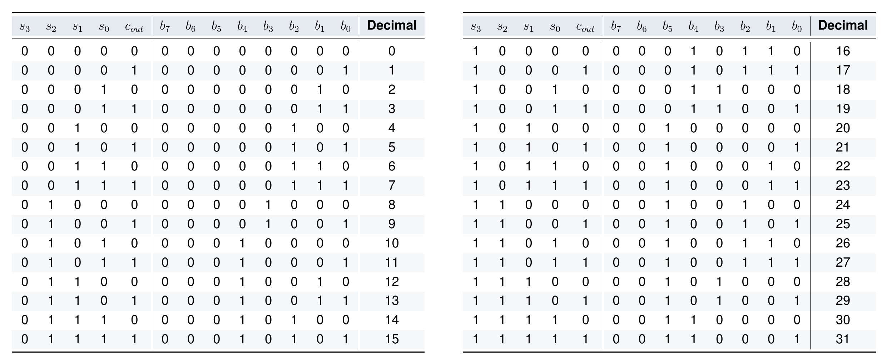

*Logisim orders the converter's inputs `s3 s2 s1 s0 cout`, with `cout` as the least
significant bit, while `bin2bcd_4.v` takes `s = {cout, sum}` with `cout` most significant.
The two describe the same function; only the pin order on the Logisim symbol differs.*

### `main.v` for Part IV

The four full adders are wired exactly as in Part III, but the sum now feeds the converter
instead of the LEDs:

```verilog
wire [7:0] bcd;

bin2bcd_4 b0 (
    .s ({cout, s}),
    .t (bcd)
);

seg7 u_hex0 (
    .w0 (bcd[0]),
    .w1 (bcd[1]),
    .w2 (bcd[2]),
    .w3 (bcd[3]),
    .hex (HEX0)
);

seg7 u_hex1 (
    .w0 (bcd[4]),
    .w1 (bcd[5]),
    .w2 (bcd[6]),
    .w3 (bcd[7]),
    .hex (HEX1)
);
```

### On the board

`HEX1`/`HEX0` showing two-digit sums. The clip reaches values above 19, which is only
possible because the operands were driven past 9. See the note below.

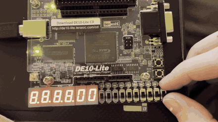

> **Manual step 3 not implemented.** The lab asks for an error indicator when `A` or `B`
> exceeds nine (`LEDG8` on the DE2). This design has no such check: the switches feed the
> adder directly, so a non-BCD operand is accepted silently and the converter reports the
> true binary sum, up to 31. That is why the clip shows readings like `23`.

### RTL view

The Part III carry chain with `bin2bcd_4` on the end, driving two decoders
([PDF](images/part_4_rtl.pdf)):

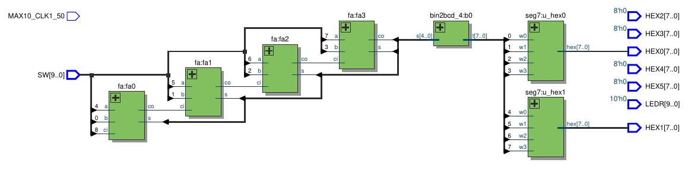

Expanded ([PDF](images/part_4_rtl_ex.pdf)):

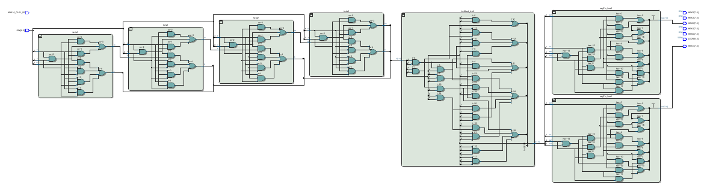

---

## Part V: Two-Digit BCD Adder

Add two 2-digit BCD numbers `A1A0` and `B1B0`. Two instances of the Part IV digit slice
are chained, the ones digit's carry feeding the tens digit.

### `add_bcd_digit.v`

Part IV's adder plus converter, packaged so it can be instantiated twice. The carry out of
the digit is `t[4]`, the low bit of the tens nibble:

```verilog
module add_bcd_digit (
    input [3:0] a, b,
    input cin,
    output [7:0] t
);

    wire c1, c2, c3, cout;
    wire [3:0] s;

    fa fa0 (.b(b[0]), .a(a[0]), .ci(cin), .co(c1),   .s(s[0]));
    fa fa1 (.b(b[1]), .a(a[1]), .ci(c1),  .co(c2),   .s(s[1]));
    fa fa2 (.b(b[2]), .a(a[2]), .ci(c2),  .co(c3),   .s(s[2]));
    fa fa3 (.b(b[3]), .a(a[3]), .ci(c3),  .co(cout), .s(s[3]));

    bin2bcd_4 conv (
        .s ({ cout, s }),
        .t (t)
    );

endmodule
```

### `main.v` for Part V

Ten switches cannot carry two full 2-digit BCD numbers, so each tens digit gets a single
switch: `A` is `SW[9]` and `SW[8:5]`, `B` is `SW[4]` and `SW[3:0]`. That gives operands of
0 to 19 each, and a largest sum of 38.

```verilog
// A = SW[9] SW[8:5], B = SW[4] SW[3:0]  (tens digit is a single switch)
wire [3:0] A1, A0, B1, B0;
assign A1 = { 3'b000, SW[9] };
assign A0 = SW[8:5];
assign B1 = { 3'b000, SW[4] };
assign B0 = SW[3:0];

wire [7:0] d0, d1;

add_bcd_digit u_ones (
    .a   (A0),
    .b   (B0),
    .cin (1'b0),
    .t   (d0)
);

add_bcd_digit u_tens (
    .a   (A1),
    .b   (B1),
    .cin (d0[4]),
    .t   (d1)
);

wire [3:0] S0, S1, S2;
assign S0 = d0[3:0];
assign S1 = d1[3:0];
assign S2 = d1[7:4];
```

`A` is displayed on `HEX5`/`HEX4`, `B` on `HEX3`/`HEX2`, and the sum on `HEX1`/`HEX0`,
through six `seg7` instances. `S2` would be the hundreds digit; with operands capped at 19
it can never be anything but 0, so it goes to `LEDR[0]` instead of a display:

```verilog
// S2 is always 0 while A and B are limited to 19
assign LEDR[0] = S2[0];
assign LEDR[9:1] = 9'b0;
```

### On the board

All six displays in use: `01` + `02` = `03`, reading `A`, `B`, then the sum.

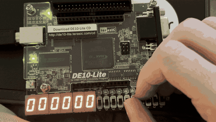

### RTL view

Two `add_bcd_digit` blocks in series feeding six decoders ([PDF](images/part_5_rtl.pdf)):

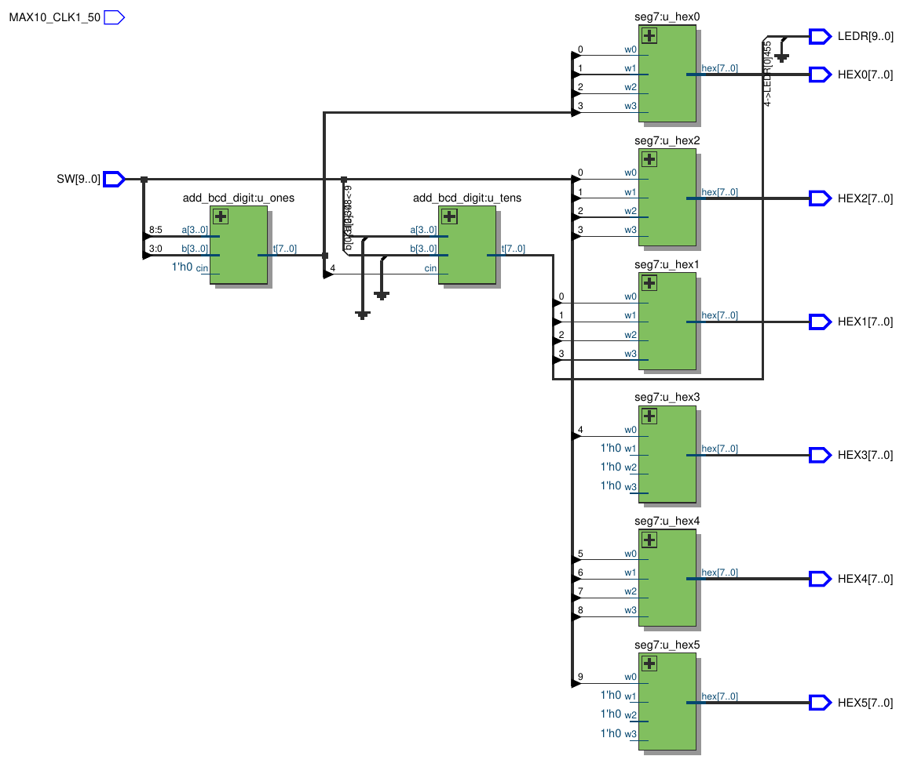

Expanded ([PDF](images/part_5_rtl_ex.pdf)):

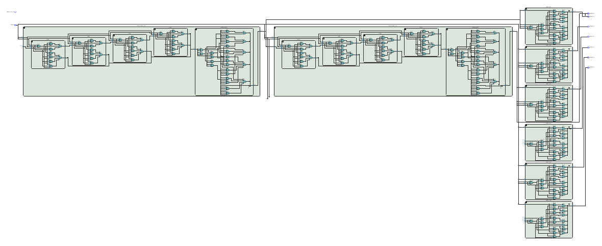

---

## Notes

- The segment outputs are active low on this board.
- Part IV does not implement the manual's `A`/`B` > 9 error indicator;
- Part V caps each operand at 19, because the ten switches cannot carry two full 2-digit
  BCD numbers. `S2` stays 0 and goes to `LEDR[0]`.
- Parts VI and VII are not done yet. (Graduate level)
