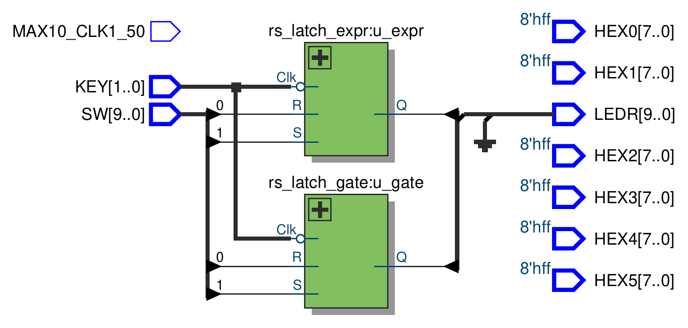
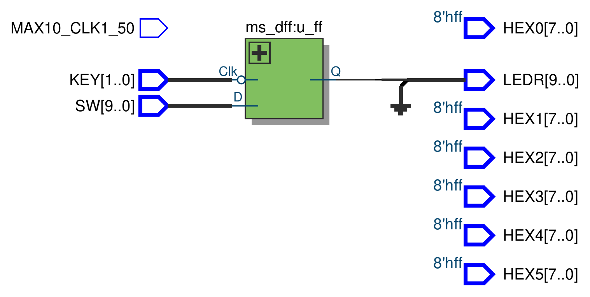
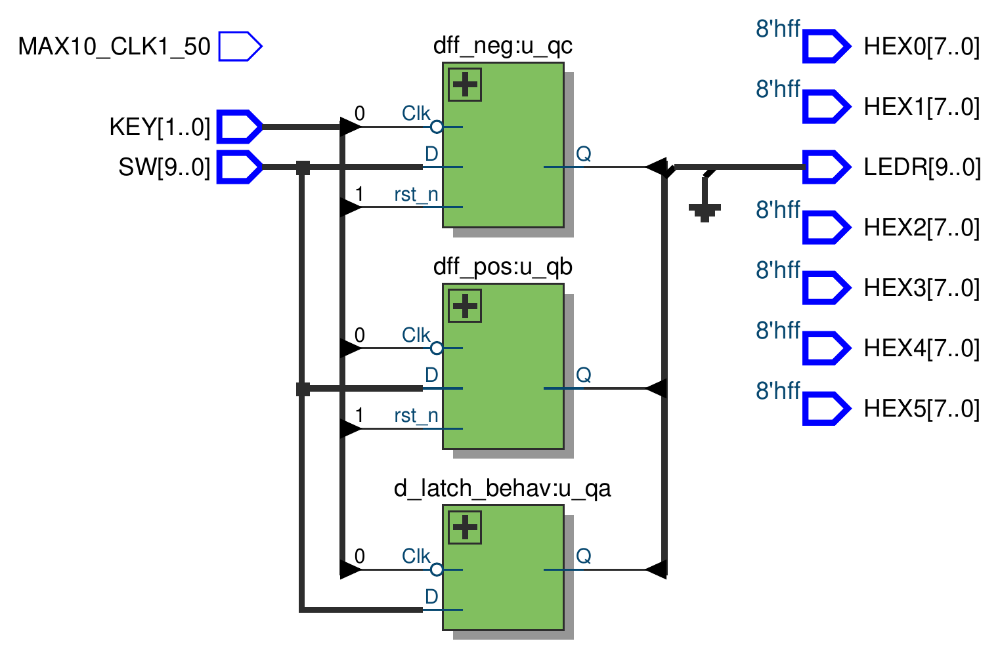
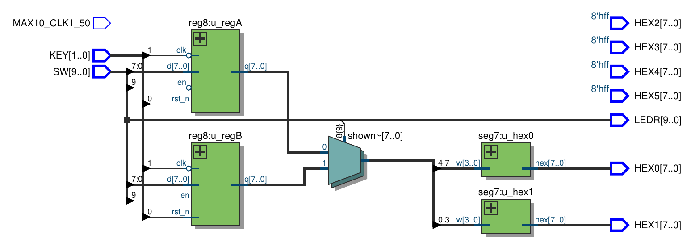

# Lab 3: Latches, Flip-Flops, and Registers

Board: **DE10-Lite**, MAX 10 `10M50DAF484C7G`. Verilog modules live in `verilog/`
(top level `main`). Every part is in `main.v`; uncomment the one to build.

> **Board differences.** The lab manual targets the DE2, which has 18 switches, toggle
> switches for the clock, and 8 displays. The DE10-Lite has 10 switches, 2 push buttons and
> 6 displays. Clocks come from the push buttons instead of a switch, and Part V is scaled
> from two 16-bit numbers down to two 8-bit registers. The buttons are **active low**, so
> every clock is `~KEY[n]`: holding the button down makes the clock high.


## Part I: Gated RS Latch

An RS latch holds one bit. With the clock high, `S` sets `Q` and `R` resets it. With the
clock low, `R_g` and `S_g` are forced to 0 and the cross-coupled NOR pair holds whatever it
had.

`R` is `SW[0]`, `S` is `SW[1]`, `Clk` is `KEY[0]`. The gate version drives `LEDR[0]` and
the expression version drives `LEDR[1]`, so both run side by side.

### `rs_latch_gate.v` (Figure 2a)

```verilog
module rs_latch_gate (
    input Clk, R, S,
    output Q
);

wire R_g, S_g, Qa, Qb /* synthesis keep */ ;

and (R_g, R, Clk);
and (S_g, S, Clk);
nor (Qa, R_g, Qb);
nor (Qb, S_g, Qa);

assign Q = Qa;

endmodule
```

### `rs_latch_expr.v` (Figure 2b)

```verilog
module rs_latch_expr (
    input Clk, R, S,
    output Q
);

wire R_g, S_g, Qa, Qb /* synthesis keep */ ;

assign R_g = R & Clk;
assign S_g = S & Clk;
assign Qa  = ~(R_g | Qb);
assign Qb  = ~(S_g | Qa);

assign Q = Qa;

endmodule
```

Without `/* synthesis keep */` the whole latch folds into one 4-input LUT. With it, each of
`R_g`, `S_g`, `Qa` and `Qb` gets its own LUT, as in Figure 3b. Synthesis reports **8 logic
elements** for Part I, 4 per latch.

### `main.v` for Part I

```verilog
wire Clk;
assign Clk = ~KEY[0];

rs_latch_gate u_gate (
    .Clk (Clk),
    .R   (SW[0]),
    .S   (SW[1]),
    .Q   (LEDR[0])
);

rs_latch_expr u_expr (
    .Clk (Clk),
    .R   (SW[0]),
    .S   (SW[1]),
    .Q   (LEDR[1])
);
```

### On the board

Both LEDs moved together. Flipping `R` or `S` did nothing until `KEY[0]` was pressed, and
the LEDs kept their state after it was released.

<!-- board photo: images/part1.jpg -->

### RTL view

The two latch versions side by side. Both get the inverted `KEY[0]` as `Clk`, `SW[0]` as
`R` and `SW[1]` as `S`, and their `Q` outputs merge into `LEDR[1:0]` with the other eight
LEDs grounded. Expanding either box shows the AND/NOR circuit of Figure 1
([PDF](images/part_1_rtl.pdf)):




---

## Part II: Gated D Latch

The RS latch with `R` tied to `~S`, so there is a single data input `D`. That also removes
the `S = R = 1` case. The latch is **level sensitive**: while `Clk` is high `Q` follows `D`,
and when `Clk` drops `Q` keeps the last value.

`D` is `SW[0]`, `Clk` is `KEY[0]`, `Q` on `LEDR[0]`.

### `d_latch.v`

Written in the Figure 2b style. `S` is just `D`, so only `R` needs its own gate. The manual's
keep list (`R`, `S_g`, `R_g`, `Qa`, `Qb`) gives **5 logic elements**.

```verilog
module d_latch (
    input D, Clk,
    output Q
);

wire R, S_g, R_g, Qa, Qb /* synthesis keep */ ;

assign R   = ~D;
assign S_g = D & Clk;
assign R_g = R & Clk;
assign Qa  = ~(R_g | Qb);
assign Qb  = ~(S_g | Qa);

assign Q = Qa;

endmodule
```

### `main.v` for Part II

```verilog
d_latch u_dl (
    .D   (SW[0]),
    .Clk (~KEY[0]),
    .Q   (LEDR[0])
);
```

### On the board

With `KEY[0]` held, `LEDR[0]` followed `SW[0]` directly. After the button was released the
LED stayed frozen, no matter what the switch did.

<!-- board photo: images/part2.jpg -->

### RTL view

One `d_latch` instance. The inverted `KEY[0]` drives `Clk`, `SW[0]` drives `D`, and `Q`
goes to `LEDR[0]` with the rest grounded ([PDF](images/part_2_rtl.pdf)):


---

## Part III: Master-Slave D Flip-Flop

Two `d_latch` copies in series with opposite clocks. The master is open while the clock is
high and the slave is open while it is low, so the two are never open together. `Q` can
only change at the moment the clock falls, when the slave opens and copies the value the
master just closed on. That makes the circuit **negative-edge triggered**.

`D` is `SW[0]`, `Clock` is `KEY[0]`, `Q` on `LEDR[0]`.

### `ms_dff.v`

```verilog
module ms_dff (
    input D, Clk,
    output Q
);

wire Qm;

d_latch master (
    .D   (D),
    .Clk (Clk),
    .Q   (Qm)
);

d_latch slave (
    .D   (Qm),
    .Clk (~Clk),
    .Q   (Q)
);

endmodule
```

Two kept latches, **10 logic elements**.

### `main.v` for Part III

```verilog
ms_dff u_ff (
    .D   (SW[0]),
    .Clk (~KEY[0]),
    .Q   (LEDR[0])
);
```

### On the board

`Clock` is `~KEY[0]`, so pressing the button is the rising edge and releasing it is the
falling edge. `LEDR[0]` only updated when the button was **released**, which confirms the
falling-edge behaviour.

<!-- board photo: images/part3.jpg -->

### RTL view

One `ms_dff` instance. `KEY[0]` enters `Clk` through an inverter (the bubble), `SW[0]`
drives `D`, and `Q` lands on `LEDR[0]` with the other nine LEDs grounded. Expanding
`u_ff` shows the two `d_latch` copies from Part II ([PDF](images/part_3_rtl.pdf)):




---

## Part IV: Latch vs. Edge-Triggered Flip-Flops

Figure 6: one `D` and one clock feed three storage elements. From here on there is no
`/* synthesis keep */`, and the storage is described behaviorally.

| Output | Element | Updates |
| --- | --- | --- |
| `Qa` | gated D latch | whenever `Clock` is high |
| `Qb` | positive-edge D flip-flop | on the rising edge |
| `Qc` | negative-edge D flip-flop | on the falling edge |

`D` is `SW[0]`, `Clock` is `KEY[0]`, and `KEY[1]` is an active-low reset for the two
flip-flops. `Qa`, `Qb` and `Qc` go to `LEDR[2:0]`.

### `d_latch_behav.v` (Figure 7)

```verilog
module d_latch_behav (
    input D, Clk,
    output reg Q
);

always @ (D, Clk)
    if (Clk)
        Q = D;

endmodule
```

### `dff_pos.v` and `dff_neg.v`

Identical except for the clock edge in the sensitivity list:

```verilog
module dff_pos (
    input D, Clk, rst_n,
    output reg Q
);

always @ (posedge Clk or negedge rst_n)
    if (!rst_n)
        Q <= 1'b0;
    else
        Q <= D;

endmodule
```

```verilog
module dff_neg (
    input D, Clk, rst_n,
    output reg Q
);

always @ (negedge Clk or negedge rst_n)
    if (!rst_n)
        Q <= 1'b0;
    else
        Q <= D;

endmodule
```

Synthesis reports **3 logic elements and 2 registers**. Quartus infers a latch for `Qa`
(`Inferred latch for "Q" at d_latch_behav.v(8)`), which sits in a single LUT. `Qb` and `Qc`
map onto the MAX 10's dedicated flip-flops, which is what step 3 of the manual asks you to
verify.

### `main.v` for Part IV

```verilog
wire D, Clk, rst_n;
assign D     = SW[0];
assign Clk   = ~KEY[0];
assign rst_n = KEY[1];

d_latch_behav u_qa (
    .D   (D),
    .Clk (Clk),
    .Q   (LEDR[0])
);

dff_pos u_qb (
    .D     (D),
    .Clk   (Clk),
    .rst_n (rst_n),
    .Q     (LEDR[1])
);

dff_neg u_qc (
    .D     (D),
    .Clk   (Clk),
    .rst_n (rst_n),
    .Q     (LEDR[2])
);
```

### On the board

`LEDR[0]` followed the switch while `KEY[0]` was held. `LEDR[1]` changed only at the press
and `LEDR[2]` only at the release. `KEY[1]` cleared `LEDR[1]` and `LEDR[2]`.

<!-- board photo: images/part4.jpg -->

### RTL view

The three storage elements side by side. All three share the inverted `KEY[0]` as their
clock and `SW[0]` as `D`. `KEY[1]` only goes to `rst_n` on the two flip-flops, since the
latch has no reset. The three `Q` outputs merge into `LEDR[2:0]`
([PDF](images/part_4_rtl.pdf)):




---

## Part V: Registers and HEX Display

Store a value from the switches so that the switches can be reused for a second value. The
manual stores a 16-bit `A` and shows `A` and `B` on eight displays. Ten switches give 8 data
bits, so this design keeps two **8-bit registers** `A` and `B`, with one switch choosing
which register loads and which one is shown.

| Control | Function |
| --- | --- |
| `SW[7:0]` | data in |
| `SW[9]` | 0 = register `A`, 1 = register `B` (load and display) |
| `KEY[1]` | clock, loads the selected register on press |
| `KEY[0]` | active-low asynchronous reset, clears both |
| `HEX1 HEX0` | selected register in hex |
| `LEDR` | mirrors `SW` |

### `reg8.v`

An 8-bit register with an enable, so both registers share one clock and `SW[9]` decides
which one takes the data:

```verilog
module reg8 (
    input clk, rst_n, en,
    input [7:0] d,
    output reg [7:0] q
);

always @ (posedge clk or negedge rst_n)
    if (!rst_n)
        q <= 8'd0;
    else if (en)
        q <= d;

endmodule
```

### `seg7.v`

A full hex decoder this time (`A b C d E F` for 10 to 15), since the registers hold
arbitrary bytes. Segments are active low.

```verilog
module seg7 (
    input [3:0] w,
    output reg [7:0] hex
);

    always@(*) begin
        case(w)
            4'd0:    hex = 8'b1100_0000;
            4'd1:    hex = 8'b1111_1001;
            4'd2:    hex = 8'b1010_0100;
            4'd3:    hex = 8'b1011_0000;
            4'd4:    hex = 8'b1001_1001;
            4'd5:    hex = 8'b1001_0010;
            4'd6:    hex = 8'b1000_0010;
            4'd7:    hex = 8'b1111_1000;
            4'd8:    hex = 8'b1000_0000;
            4'd9:    hex = 8'b1001_0000;
            4'd10:   hex = 8'b1000_1000; // A
            4'd11:   hex = 8'b1000_0011; // b
            4'd12:   hex = 8'b1100_0110; // C
            4'd13:   hex = 8'b1010_0001; // d
            4'd14:   hex = 8'b1000_0110; // E
            4'd15:   hex = 8'b1000_1110; // F
            default: hex = 8'b1111_1111;
        endcase
    end

endmodule
```

### `main.v` for Part V

```verilog
wire Clk, rst_n;
assign Clk   = ~KEY[1];
assign rst_n = KEY[0];

wire [7:0] A, B;

reg8 u_regA (
    .clk   (Clk),
    .rst_n (rst_n),
    .en    (~SW[9]),
    .d     (SW[7:0]),
    .q     (A)
);

reg8 u_regB (
    .clk   (Clk),
    .rst_n (rst_n),
    .en    (SW[9]),
    .d     (SW[7:0]),
    .q     (B)
);

wire [7:0] shown;
assign shown = SW[9] ? B : A;

seg7 u_hex0 (
    .w   (shown[3:0]),
    .hex (HEX0)
);

seg7 u_hex1 (
    .w   (shown[7:4]),
    .hex (HEX1)
);

assign LEDR = SW;
assign { HEX5, HEX4, HEX3, HEX2 } = { 4{8'hFF} };
```

Full compile: **31 logic elements, 16 registers** (the two 8-bit registers).

### On the board

Load a byte into `A`, flip `SW[9]`, load a second byte into `B`, and toggle `SW[9]` to switch
between the two on `HEX1`/`HEX0`. `KEY[0]` returned both to `00`.

<!-- board photo: images/part5.jpg -->

### RTL view

Two `reg8` instances share `KEY[1]` as the clock and `KEY[0]` as the reset, with `SW[9]`
driving `u_regA`'s enable inverted and `u_regB`'s directly. The `shown` mux picks one
register for the two `seg7` decoders, and `LEDR` is wired straight from `SW`
([PDF](images/part_5_rtl.pdf)):




---

## Notes

- The push buttons are active low, so every clock is `~KEY[n]` and every reset is `KEY[n]`
  used directly.
- Parts II and III use `KEY[0]` as the clock instead of `SW1`. A button gives a clean edge
  to watch, and in Part III it makes the falling edge line up with releasing the button.
- Part V is two 8-bit registers selected by `SW[9]`, not the manual's two 16-bit numbers on
  eight displays, because the board has only ten switches and six displays.
- Unused LEDs are driven to 0 and unused displays to `8'hFF` (blank) in every part.
- **No timing simulation.** The manual asks for QSim timing simulation in Parts I and II.
  For the MAX 10, Quartus 25.1 refuses to write a timing netlist: *"Generated the EDA
  functional simulation netlist because it is the only supported netlist type for this
  device."* The post-fit simulation therefore checks the fitted logic, not gate delays.
- The bundled Questa could not check out its license on this machine, so every
  simulation runs in iverilog. For the post-fit runs, the MAX 10 cell library's IO
  buffers and unused flash/ADC blocks are Questa-only encrypted cores. `postfit_sim.py`
  swaps them for pass-through wires and empty shells. The LUT and flip-flop models, which
  hold all the logic, are Quartus's own, unmodified.
- `quartus/` holds the project's `main.qpf`/`main.qsf` (DE10-Lite pin assignments) so
  `postfit_sim.py` can rebuild each part.
