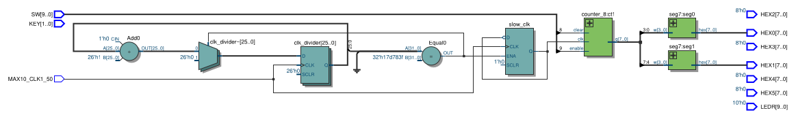
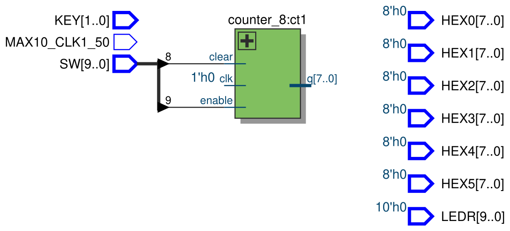
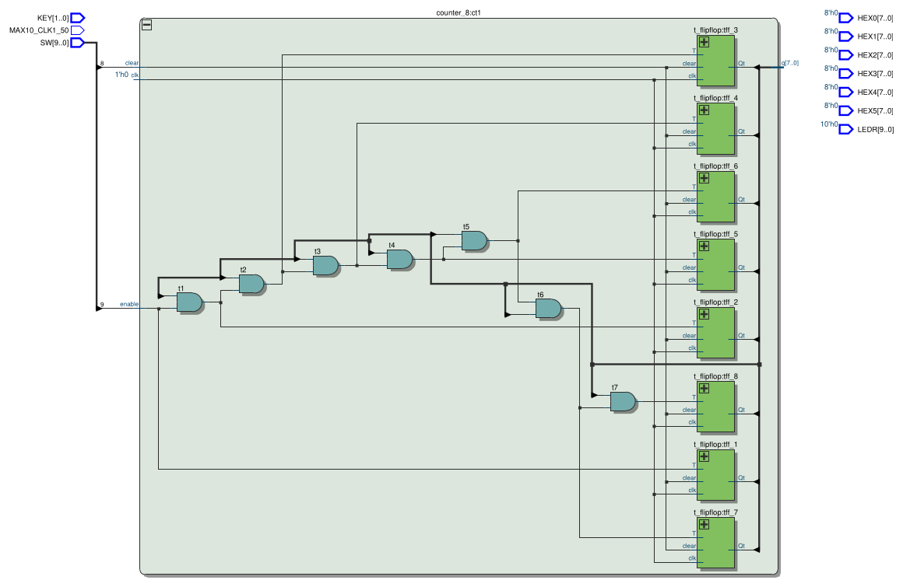
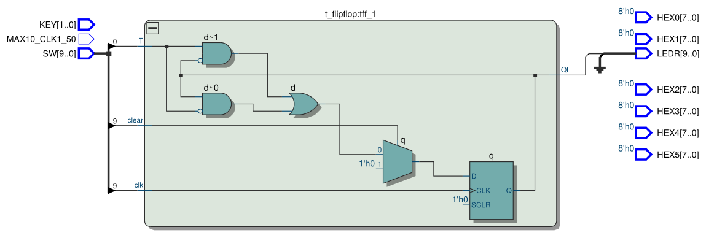
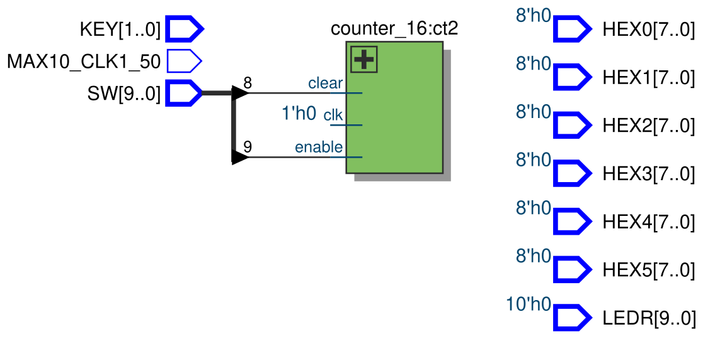
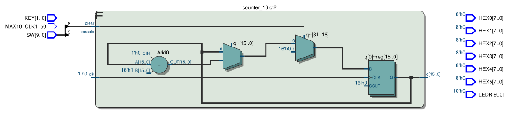
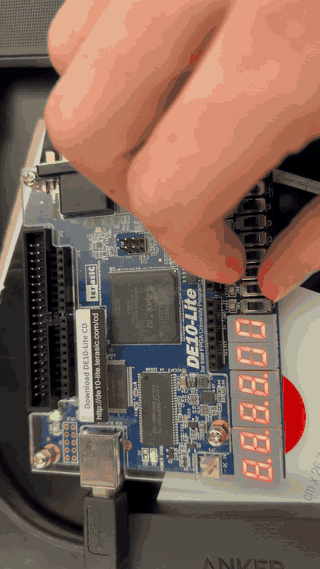
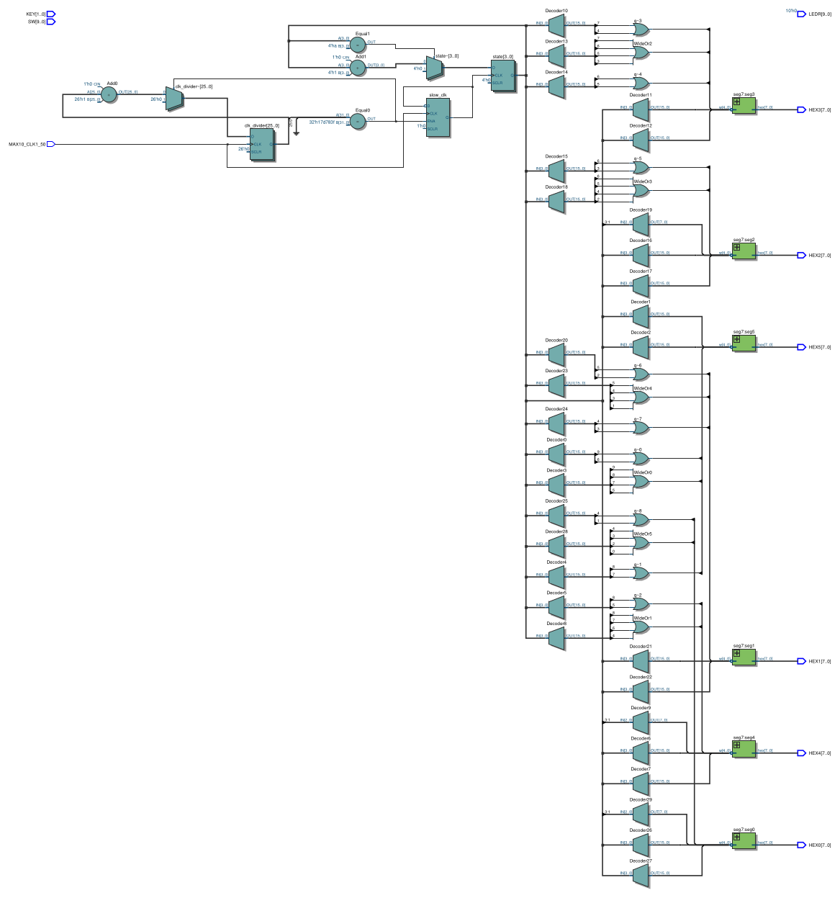

# Lab 4: Counters

Board: **DE10-Lite**, MAX 10 `10M50DAF484C7G`. Verilog modules live in `verilog/`
(top level `main`). Every part is in `main.v`; uncomment the one to build.

> **Board differences.** The lab manual targets the DE2, which has 18 switches, toggle
> switches for the clock, and 8 displays. The DE10-Lite has 10 switches, 2 push buttons
> and 6 displays. Part V scrolls `HELLO` across the six available displays `HEX5`-`HEX0`
> instead of the manual's `HEX7`-`HEX0`. Part I uses a 1 Hz clock divided from the on-board
> 50 MHz oscillator rather than `KEY[0]`, so the 8-bit count is actually watchable on the
> displays. Part III (LPM counter) is not implemented — Parts I and II already give a
> structural and a behavioral counter to compare against.


## Part I: 8-bit T Flip-Flop Counter

Figure 1: a synchronous counter built out of T flip-flops. Each stage toggles when `T = 1`
on the rising clock edge. The enable chains through a wide AND so that stage `n` toggles
only after every lower bit is 1, which is what makes the whole thing count in binary.

`Enable` is `SW[9]`, `Clear` is `SW[8]`, the clock is the 1 Hz `slow_clk` divided from
`MAX10_CLK1_50`, and the 8-bit count shows in hex on `HEX1`/`HEX0`.

### `t_flipflop.v`

```verilog
module t_flipflop (
	input T, clk, clear,
	output Qt
);
	wire d;
	reg q;

	always @(posedge clk) begin
		if (clear)
			q <= 8'd0;
		else
			q <= d;
	end
	
	assign d = (q & ~T) | (T & ~q);
	assign Qt = q;

endmodule
```

`d = T XOR q` written out as the two minterms. On every clock edge, `q` either stays or
flips depending on `T`. `clear` is synchronous and active high.

### `counter_8.v`

Eight TFFs chained with an AND tree. `tff_n` only toggles when `enable` and every lower
bit are all 1:

```verilog
module counter_8 (
	input clk, enable, clear,
   output [7:0] q
);
	
	t_flipflop tff_1 (
		.T(enable),
		.clk(clk),
		.clear(clear),
		.Qt(q[0])
	 );
	 
	 wire t1;
	 assign t1 = enable & q[0]; 
	 t_flipflop tff_2 (
		.T(t1),
		.clk(clk),
		.clear(clear),
		.Qt(q[1])
	 );
	 
	 // ...tff_3 through tff_8, each ANDing in the next bit
	 
endmodule
```

(The full file wires all eight stages; the pattern repeats.)

### `main.v` for Part I

```verilog
wire [7:0] q;

counter_8 ct1 (
	.clk(slow_clk),
	.enable(SW[9]), 
	.clear(SW[8]),
	.q(q)
);

seg7 seg0 (
	.w(q[3:0]),
	.hex(HEX0)
);

seg7 seg1 (
	.w(q[7:4]),
	.hex(HEX1)
);
```

**LEs:** _TODO_ ,  **Fmax:** _TODO_ (compile with just this block uncommented and read
from the flow summary / Timing Analyzer).

### On the board

With `SW[9]` high the count ticks once per second, running `HEX1`/`HEX0` from `00` through
`FF` and back. `SW[8]` high clears both halves on the next edge.

<!-- board photo: images/part1_board.jpg -->

### RTL view

Just the counter driving two hex decoders, with the 1 Hz clock divider in front
([PDF](images/8bit_counter_tff_7seg.pdf)):



The counter alone, without the display logic, is the cleanest look at the Figure 1
structure ([PDF](images/8bit_counter_tff.pdf)):



Expanded, each `t_flipflop` becomes a DFF with a feedback mux and the toggle gate out
front. The AND chain between stages is what Quartus synthesizes the Figure 1 enable
network into ([PDF](images/8bit_counter_tff_ex.pdf)):



A single `t_flipflop` on its own, expanded, shows the mux + DFF structure Quartus picks
rather than the two cross-coupled gates drawn in Figure 1 ([PDF](images/part1_tff_ex.pdf)):



The difference from Figure 1 is that Quartus doesn't build the TFF out of gates. It infers
a dedicated flip-flop and uses a 2-to-1 mux (selecting between `q` and `~q`) on its D
input, since `D = T XOR Q`. The MAX 10 has DFFs in its logic elements, so the toggle gate
collapses into one LUT in front of each FF.


---

## Part II: 16-bit Register Counter

Same job as Part I, but written behaviorally as a register with `+ 1`:

```verilog
module counter_16 (
	input clk, enable, clear,
	output reg [15:0] q
);

	always @(posedge clk) begin
		if (clear) 
			q <= 0;
		else if (enable)
			q <= q + 1;
	end

endmodule
```

### `main.v` for Part II

```verilog
wire [15:0] q;

counter_16 ct2 (
	.clk(slow_clk),
	.enable(SW[9]), 
	.clear(SW[8]),
	.q(q)
);
```

**LEs:** _TODO_ ,  **Fmax:** _TODO_.

### RTL view

One compact block with the clock divider on its front side
([PDF](images/16bit_counter.pdf)):



Expanded, Quartus builds this as a single carry-chain adder feeding a bank of flip-flops
with sync clear and enable ([PDF](images/16bit_counter_ex.pdf)):



Compared with Part I, there is no T-flop and no AND tree — the whole counter is one adder
plus 16 FFs. Quartus synthesizes `+ 1` straight into the MAX 10 carry chain, which is
tighter and faster than the ripple-toggle structure of Part I even though both describe
the same count sequence.


---

## Part IV: Flashing 0-9 on HEX0

Count digits 0 through 9 on `HEX0`, one per second, clocked directly from the on-board
50 MHz `MAX10_CLK1_50`. No new clock is derived — the slow 1 Hz tick comes from the same
`clk_divider` the other parts use, and the digit counter is itself clocked on the
50 MHz edge through the enable.

### Clock divider (shared, at the top of `main.v`)

```verilog
// 26 bits can count up to 67,108,863
reg [25:0] clk_divider;
reg slow_clk = 1'b0;
	 
// Toggle slow clk every 25,000,000 cycles (0.5 seconds at 50MHz)
localparam CLK_DELAY = 25000000;

always @(posedge MAX10_CLK1_50) begin
	if (clk_divider == CLK_DELAY - 1) begin 
		clk_divider <= 26'd0;     // reset divider
		slow_clk    <= ~slow_clk; // toggle slow clk
	end else begin
		clk_divider <= clk_divider + 1'b1; // increment divider
	end
end
```

25 million 50 MHz ticks is 0.5 s, so `slow_clk` toggles twice per second: one full period
is 1 s, which is the rate the digit should advance.

### `main.v` for Part IV

```verilog
reg [3:0] digit = 4'd0;

always @(posedge slow_clk) begin
	if (digit == 4'd9)
		digit <= 4'd0;         // wrap back to 0
	else
		digit <= digit + 4'd1; // next digit
end

seg7 seg0 (
	.w({1'b0, digit}),
	.hex(HEX0)
);
```

`seg7` takes a 5-bit input (so it can also display A-F and the Part V letters), so the
4-bit digit is zero-extended. Values 0 to 9 map straight to the digit patterns in the
decoder.

**LEs:** _TODO_ ,  **Fmax:** _TODO_.

### On the board

`HEX0` steps through `0, 1, 2, ..., 9, 0, 1, ...` with roughly one second between digits.
The other five displays are blank.

<!-- board photo: images/part4_board.jpg -->

### RTL view

_TODO: compile with only the Part IV block uncommented and capture the RTL + expanded
RTL._

<!--  -->


---

## Part V: HELLO Ticker

Scroll the word `HELLO` across the six displays, one shift per second. The manual uses
eight displays (`HEX7`-`HEX0`); this version runs on the DE10-Lite's six (`HEX5`-`HEX0`).

### Letters in `seg7`

The decoder already covers 0-F for Parts I/II. Three more codes are added for the
letters `H`, `L`, and a blank:

```verilog
// Special characters
5'd16:   hex = 8'b1000_1001; // H
5'd17:   hex = 8'b1100_0111; // L
5'd18:   hex = 8'b1111_1111; // blank
```

`E` already matches code 14 (0xE) and `O` already matches 0, so they are reused.

### State machine

`state` steps once per second on `posedge slow_clk`. Each state maps to a frame of the
scrolling pattern via a case statement:

```verilog
localparam [4:0] CHAR_O = 5'd0;
localparam [4:0] CHAR_E = 5'd14;
localparam [4:0] CHAR_H = 5'd16;
localparam [4:0] CHAR_L = 5'd17;
localparam [4:0] BLANK  = 5'd18;
	 
reg [3:0] state = 4'd0;
reg [29:0] q;
	 
always @(posedge slow_clk) begin
	if (state == 4'd10)
		state <= 4'd0; // loop back to 0
	else
		state <= state + 4'd1; // move to the next state
end
	 
always @(*) begin
	case (state)
		4'd0: q = {BLANK, BLANK, BLANK, BLANK, BLANK, CHAR_H};	  //     H
		4'd1: q = {BLANK, BLANK, BLANK, BLANK, CHAR_H, CHAR_E}; 	  //    HE
		4'd2: q = {BLANK, BLANK, BLANK, CHAR_H, CHAR_E, CHAR_L};   //   HEL
		4'd3: q = {BLANK, BLANK, CHAR_H, CHAR_E, CHAR_L, CHAR_L};  //  HELL
		4'd4: q = {BLANK, CHAR_H, CHAR_E, CHAR_L, CHAR_L, CHAR_O}; // HELLO
		4'd5: q = {CHAR_H, CHAR_E, CHAR_L, CHAR_L, CHAR_O, BLANK}; //HELLO 
		4'd6: q = {CHAR_E, CHAR_L, CHAR_L, CHAR_O, BLANK, BLANK};  //ELLO  
		4'd7: q = {CHAR_L, CHAR_L, CHAR_O, BLANK, BLANK, BLANK};   //LLO   
		4'd8: q = {CHAR_L, CHAR_O, BLANK, BLANK, BLANK, BLANK};    //LO    
		4'd9: q = {CHAR_O, BLANK, BLANK, BLANK, BLANK, BLANK};     //O     
		default: q = {BLANK, BLANK, BLANK, BLANK, BLANK, BLANK};
	endcase
end
```

In the concatenation the first element is the MSB and lands on `HEX5` (leftmost display);
the last element lands on `HEX0`. So state 0 shows `H` entering from the right, states 1-4
walk it across until the whole word is on screen, states 5-9 push it off the left, and
state 10 is one blank frame before the sequence restarts.

### Display wiring

Each 5-bit slice of `q` drives one `seg7` instance:

```verilog
seg7 seg0 ( .w(q[4:0]),   .hex(HEX0) );
seg7 seg1 ( .w(q[9:5]),   .hex(HEX1) );
seg7 seg2 ( .w(q[14:10]), .hex(HEX2) );
seg7 seg3 ( .w(q[19:15]), .hex(HEX3) );
seg7 seg4 ( .w(q[24:20]), .hex(HEX4) );
seg7 seg5 ( .w(q[29:25]), .hex(HEX5) );
```

Full compile reports **83 logic elements and 31 registers** (26 for the clock divider,
4 for `state`, 1 for `slow_clk`).

### On the board

`HELLO` scrolls right-to-left across all six displays at one shift per second, then one
blank frame, then starts again from the right.



### RTL view

The clock divider and `state` register sit on the left; a bank of decoders and OR gates
on the right builds the six 5-bit slices of `q` and hands them to one `seg7` per display
([PDF](images/part5.pdf)):




---

## Notes

- Part III (LPM 16-bit counter) is not implemented.
- The counters in Parts I and II use the 1 Hz `slow_clk` rather than `KEY[0]` so the full
  count is actually visible on the displays. The structure of each design is unchanged.
- `clear` in the T flip-flop is synchronous (`if (clear)` inside the `posedge clk` block),
  not asynchronous as Figure 1 suggests.
- Part V has one blank frame per cycle (state 10) between the last `O` leaving and the
  next `H` entering, instead of looping straight back to `HELLO`.
